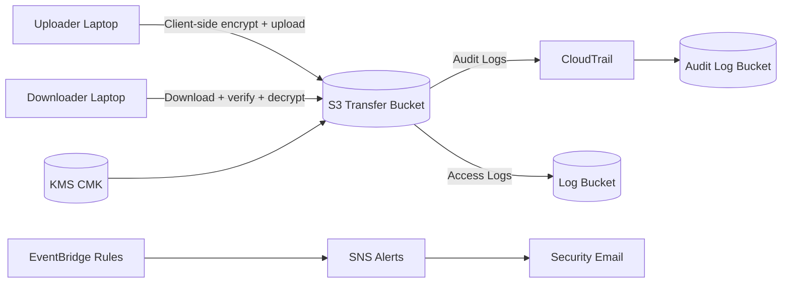

# Secure S3 Transfer

Secure S3 Transfer is a hardened file-transfer system for external laptops over the public internet. It uses AWS S3 + KMS with strict guardrails, IAM role separation (uploader vs downloader), and an operational toolchain for onboarding, validation, and auditability.

This documentation set is approval-focused and written for governance review (CIO/CISO/security committee). Start with the overview below and follow the links for detail.

## Start here
- **Overview:** [docs/00-overview.md](docs/00-overview.md)
- **Architecture & Data Flows:** [docs/10-architecture-and-data-flows.md](docs/10-architecture-and-data-flows.md)
- **Security Architecture & Controls:** [docs/20-security-architecture-and-controls.md](docs/20-security-architecture-and-controls.md)
- **Operations & Runbooks:** [docs/30-operations-and-runbooks.md](docs/30-operations-and-runbooks.md)
- **Troubleshooting & FAQ:** [docs/40-troubleshooting-and-faq.md](docs/40-troubleshooting-and-faq.md)

## How it works (1 minute)


## What’s included
- S3 transfer bucket with enforced TLS + SSE-KMS + key pinning
- Least-privilege uploader/downloader IAM roles
- Client-side envelope encryption (AES-256-GCM) and SHA-256 integrity
- CloudTrail multi-region audit logging + immutable audit bucket
- Encrypted CloudWatch log group
- Alerting on policy/key/role changes (EventBridge → SNS)
- Client onboarding scripts + USB-friendly installer
- Validation and testing scripts

## What’s not included
- Malware scanning pipeline in AWS (only local Windows Defender scan on client)
- Automated incident response workflows
- Organization-wide governance (SCPs, org trails)

## Assumptions
- AWS Identity Center (SSO) is available for user auth
- Endpoints are Windows laptops with PowerShell 7 + AWS CLI v2
- Network access to AWS APIs/S3 over HTTPS

## Quick start (client use)
Upload (after setup):
```
pwsh -File scripts\upload\Upload_To_S3.ps1 -InputFilePath C:\path\file.txt -AutoStart
```

Download (after setup):
```
pwsh -File scripts\download\Download_From_S3.ps1 -DestinationPath C:\Downloads -AutoStart
```

## USB installer (no repo required)
For non-technical users, build and distribute a standalone installer + client pack:
```
pwsh -File scripts\installer\build-client-pack.ps1
pwsh -File scripts\installer\build-bootstrapper.ps1
```
Copy `dist\SecureS3Transfer-Installer.exe`, `dist\ClientPack.zip`, and a prefilled `.env` to a USB. The EXE installs to `%ProgramData%\SecureS3Transfer` and launches the guided setup.
