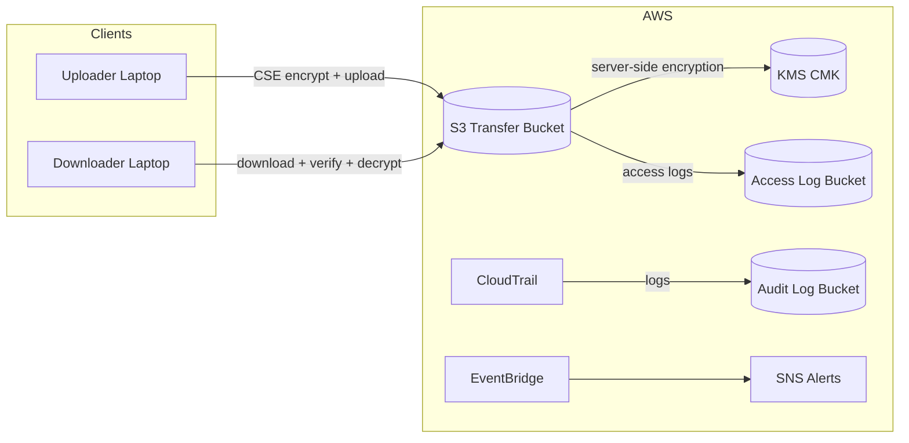
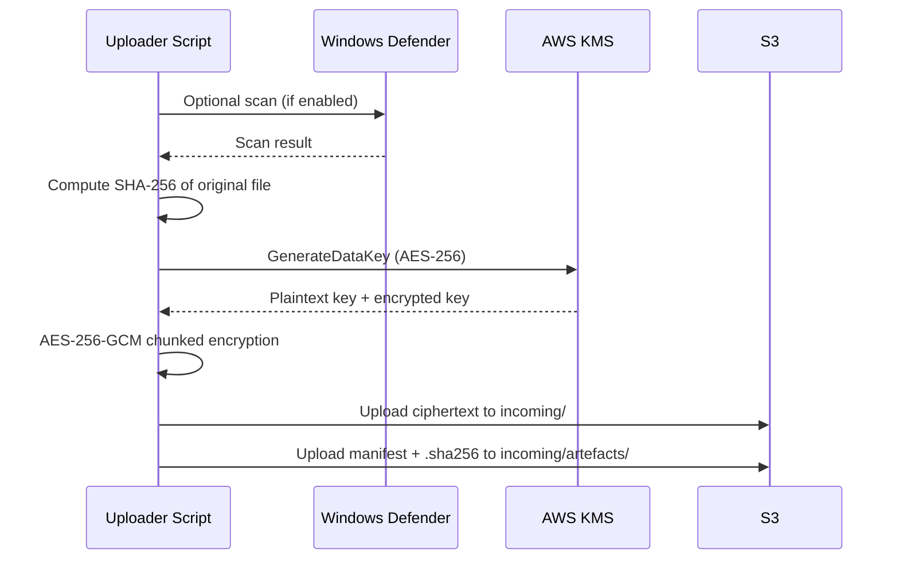
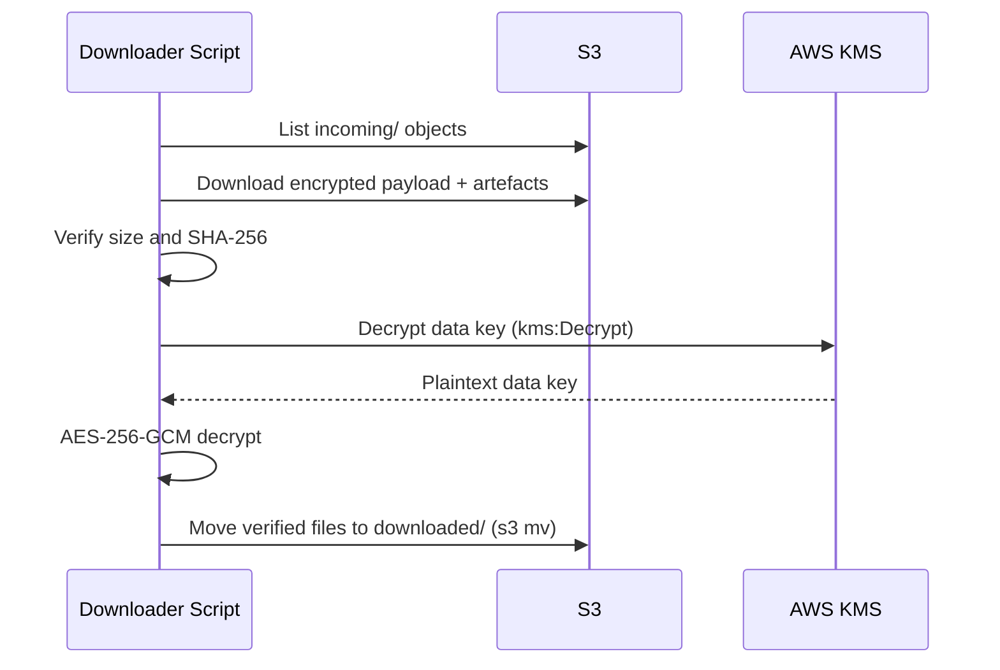
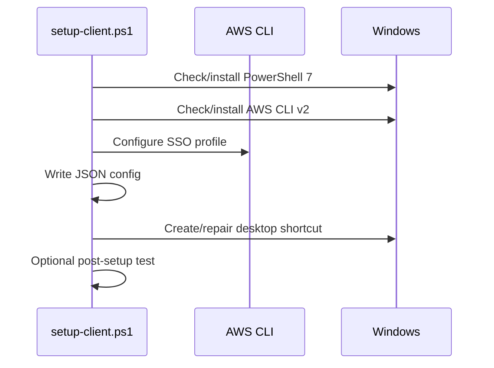

# 10 – Architecture and Data Flows

This document explains how data moves end-to-end without requiring code reading. It includes flow diagrams, inputs/outputs, and failure points.

## System context

### Trust boundaries (who can see what)
- **Client endpoint**: plaintext file content and plaintext data key exist only on the uploader/downloader device during processing.
- **AWS control plane**: Identity Center, IAM, KMS policy evaluation and CloudTrail events.
- **AWS data plane**: S3 object storage and access logging; objects are stored encrypted.
- **Operations boundary**: admins can change policies/roles but cannot read encrypted payloads without KMS permissions.

## Prefix layout (S3)
| Prefix | Purpose | Contents |
|---|---|---|
| `incoming/` | Upload staging | Encrypted payloads (`.enc` if enabled) |
| `incoming/artefacts/` | Integrity + crypto metadata | `.sha256` hash, `.cse.manifest.json` |
| `downloaded/` | Archive | Verified files moved after download |
| `downloaded/artefacts/` | Archive artefacts | Manifest + hash for archived files |

## A) Upload flow (end-to-end)
**Inputs**
- Local file path
- AWS SSO profile
- Bucket + KMS key ID (from config)

**Outputs**
- Encrypted object in `incoming/`
- `.sha256` + manifest in `incoming/artefacts/`
- Local log in `%USERPROFILE%\Documents\SecureUploadLogs`
- Optional use of S3 Transfer Acceleration (if enabled in config/profile)

**Sequence**

**Data at rest / in transit**
- In transit: HTTPS/TLS to AWS
- At rest: SSE-KMS on S3, plus client-side encrypted payload
- Keys: plaintext data key exists only in memory on client; encrypted data key stored in manifest

**Key material exposure (summary)**
| Item | Location | Stored? |
|---|---|---|
| Plaintext data key | Client memory only | No |
| Encrypted data key | Manifest in `incoming/artefacts/` | Yes |
| Plaintext file | Client disk (pre‑upload) | Yes |
| Encrypted payload | S3 `incoming/` | Yes |

**Transfer Acceleration**
- If enabled, the AWS CLI profile uses the accelerate endpoint to improve throughput on large uploads.
- The upload script validates acceleration availability and uses profile settings; it does not force acceleration if the bucket is not enabled.

**Failure points & recovery**
- KMS GenerateDataKey denied → check role/key policy
- Defender scan timeout → upload continues if scan optional
- Upload failure → retry; ciphertext not finalized
- Manifest/hash missing → integrity verification and download will fail

## B) Download flow (end-to-end)
**Inputs**
- AWS SSO profile
- Bucket + KMS key ID

**Outputs**
- Verified file in local download directory
- Archived objects moved to `downloaded/`
- Local log in `%USERPROFILE%\Documents\SecureDownloadLogs`

**Sequence**

**Data at rest / in transit**
- In transit: HTTPS/TLS
- At rest (cloud): SSE-KMS + encrypted payload
- At rest (local): plaintext output after successful verification

**Archive semantics**
- The downloader uses `aws s3 mv` to archive (copy to `downloaded/`, then delete from `incoming/`).
- Deletes are gated by bucket policy allowlist patterns and IAM permissions; if delete is denied, the file remains in `incoming/` and the log records the failure.

**Failure points & recovery**
- Missing manifest/sha256 → skip archive and log warning
- Hash mismatch → fail verification; file not archived
- KMS decrypt denied → check role/key policy

## C) Setup flow (client onboarding)
**Inputs**
- `.env` with SSO + bucket + key info

**Outputs**
- AWS CLI SSO profiles
- `config.upload.json` or `config.download.json`
- Desktop shortcut for Upload/Download

**Sequence**

**Failure points & recovery**
- Missing `.env` → setup stops and prompts to provide values
- Prereqs missing → installer attempts install; manual fallback if failed
- Existing config → if not `-Force`, setup warns and leaves config unchanged

## Why these design choices
- **Manifest + SHA-256** ensures integrity before archive.
- **Artefacts prefix** separates security metadata from payloads for auditing.
- **Archive to downloaded/** keeps source of truth and avoids destructive reads.

## Traceability (features → files)
| Feature | Primary files |
|---|---|
| Upload flow | `scripts/upload/Upload_To_S3.ps1`, `scripts/config/config.upload.example.json` |
| Download flow | `scripts/download/Download_From_S3.ps1`, `scripts/config/config.download.example.json` |
| Setup flow | `scripts/setup/setup-client.ps1`, `scripts/setup/configure-sso.ps1`, `scripts/setup/test-client.ps1` |
| Installer | `scripts/installer/bootstrapper.ps1`, `scripts/installer/build-*.ps1`, `scripts/installer/README.md` |

**Next:** [20-security-architecture-and-controls.md](20-security-architecture-and-controls.md)
